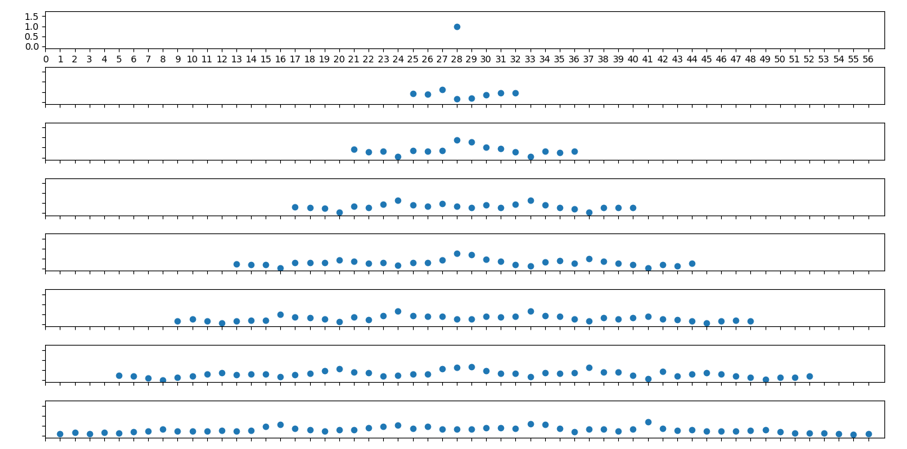
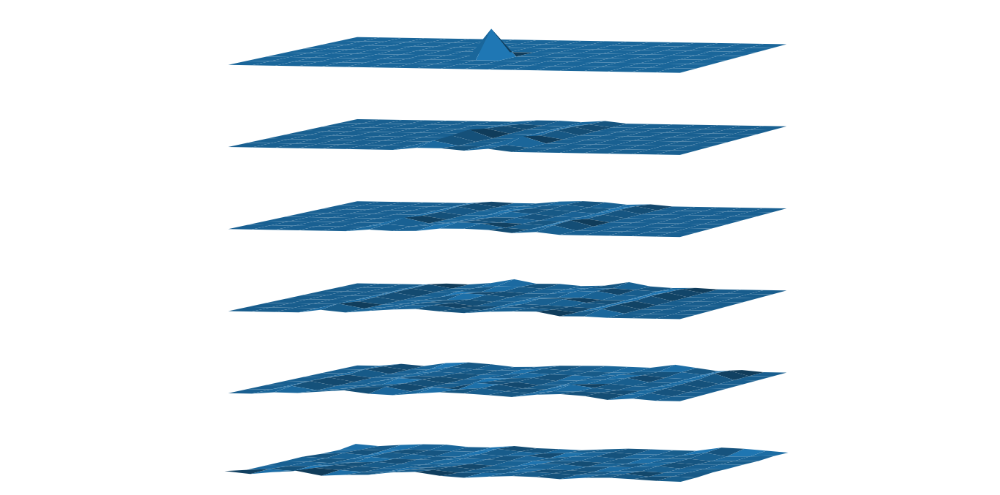

# Camino aleatorio de una fuerza en una estructura de ladrillos
Este programa es una simulación del camino aleatorio que sigue una fuerza aplicada en una estructura de ladrillos. Se trata de un proceso aleatorio, porque se eligen aleatoriamente los puntos de apoyo; y con restricciones, ya que esos puntos tienen que satisfacer las ecuaciones de equilibrio. 

[Estructura de ladrillos](./img/esquema03.pdf)

El programa principal es [ladrillos_fuerzas](./v1/ladrillos_fuerzas_v1.py), el cual realiza una simulación del recorrido de una fuerza en un estructura de ladrillos. Este funciona de la siguiente manera:  
1 - En la hilada x. Se detectan las fuerzas aplicadas al ladrillo\
2 - Se calcula la resultante de esas fuerzas\
3 - Se genera un trio de posibles puntos de apoyos aleatoriamente; desde aquí se pueden dar dos opciones:\
  4a - Ese trio de posibles puntos de apoyo no satisface las condiciones de equilibrio. Entonces se retrocede una hilada y se empieza por el punto 1.\
  4b - Ese trio de posibles puntos de apoyo satisface las condiciones de equilibrio. Entonces se avanza una hilada y se vuelve a empezar por el punto 1.
  
[Diagrama de flujo del programa](./img/diagrama_flujo.pdf)

Para más información sobre cómo funciona el código ver las anotaciones en el archivo .py

De este programa se pueden modificar los parámetros iniciales (el número de hiladas, la discretización de los ladrillos y la fuerza inicial). El programa devuelve una matriz localizada en resultados.txt

Aparte, el programa [tm_y_fp](./v1/tm_y_fp.py) realiza el programa ladrillos_fuezas x veces y devuelve dos matrices: tension_media.txt, la cual contiene la tensión media que ha pasado por cada punto de la estructura; y frecuencia_paso.txt, que contiene la frecuencia de paso de cada punto de la estructura.

Por último, [gaussianas2d](./v1/gaussianas2d.py) y [grafica3d](./v1/graficas3d.py) muestran las matrices tension_media.txt y frecuencia_paso.txt de manera gráfica, en 2 y 3 dimensiones respectivamente. La gráfica 2d tiene la opción de mostrar o no un ajuste gaussiano (incluyendo los comentarios en verde en gaussiana_2d)

Algunos ejemplos de las gráficas dados por el programa (gráficas no relacionadas entre sí).

